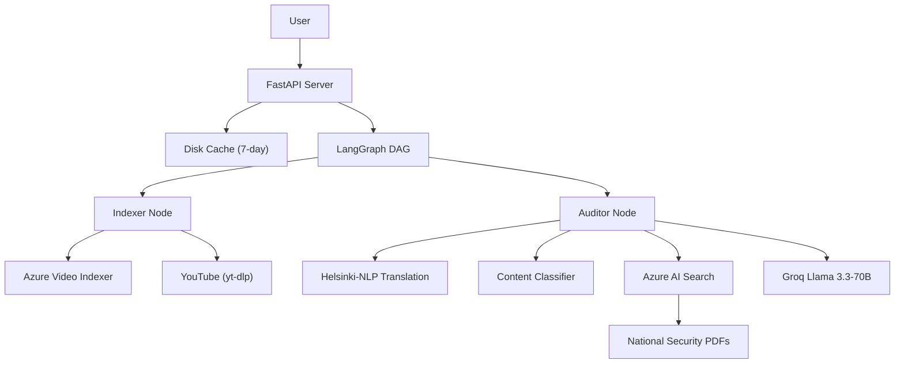

# 🇮🇳 National Security Shield

> **AI-Powered Video Threat Detection for National Security**

[](https://python.org)
[](https://fastapi.tiangolo.com)
[](https://langchain-ai.github.io/langgraph/)
[](https://groq.com)
[](https://azure.microsoft.com)
[](LICENSE.md)

---

## 🏆 Overview

**National Security Shield** is an AI-powered platform that automatically detects security threats in YouTube videos. It uses a multi-stage AI pipeline combining speech-to-text, language translation, RAG-based knowledge retrieval, and large language model analysis to identify terrorism, hate speech, espionage, border security leaks, cyber threats, and disinformation.

Built for India's national security context — supports Hindi/Urdu content, understands Indian threat patterns, and generates intelligence-grade reports suitable for legal action under IT Act Section 69A.

---

## 🎯 Problem It Solves

Social media is weaponized for:
- **Pre-attack reconnaissance** — Videos discussing security gaps and troop movements
- **Hate speech & communal incitement** — Content targeting religious communities
- **Espionage** — Disclosure of sensitive security information
- **Disinformation** — Coordinated propaganda campaigns

Manual moderation cannot scale. This system provides **automated, AI-driven analysis** with **intelligence-grade reporting**.

---

## ✨ Key Features

| Feature | Technology | Impact |
|---------|-----------|--------|
| **Video Analysis** | yt-dlp + Azure Video Indexer | Downloads and processes any YouTube video |
| **Speech-to-Text** | Azure Video Indexer | Extracts transcript with timestamps |
| **OCR Extraction** | Azure Video Indexer | Reads on-screen text from video frames |
| **Hindi Translation** | Helsinki-NLP opus-mt-hi-en | Translates Hindi/Urdu to English |
| **Smart Classification** | Custom keyword-matching | Identifies fiction (movies, music, games) to reduce false positives |
| **RAG Knowledge Base** | Azure AI Search + HuggingFace | Queries national security protocols for informed analysis |
| **Threat Analysis** | Groq Llama-3.3-70B | Detects 6 threat categories with confidence scoring |
| **Intelligence Reports** | Custom formatter | Generates formatted reports for agency action |
| **Caching** | SHA-256 keyed disk cache | Same URL = instant result (7-day expiry) |
| **Web Dashboard** | HTML/CSS/JS + Chart.js | Dark-themed UI with real-time progress and analytics |
| **CLI Interface** | Python argparse | Scriptable automation support |
| **Observability** | Azure Monitor OpenTelemetry | Auto-captures API metrics, errors, and performance |

---

## 🧠 Threat Categories Detected

```
🚨 TERRORISM        — Bombings, attacks, explosions, incitement to violence
🛡️ BORDER_SECURITY  — Military movements, patrol gaps, troop disclosures
💻 CYBER_THREAT     — Hacking, malware, phishing campaigns
📰 FAKE_NEWS        — Disinformation, propaganda, false reporting
💬 HATE_SPEECH      — Communal violence, religious targeting, incitement
🕵️ ESPIONAGE        — Intelligence leaks, spy activity, ISI patterns
```

---

## 🏗️ Architecture



**Pipeline:** `YouTube URL → Download → Azure VI Processing → Transcript + OCR → Language Detection → Hindi Translation → Fiction Check → RAG Query → LLM Analysis → Report Generation`

---

## 🛠️ Tech Stack

| Category | Technologies |
|----------|-------------|
| **Backend** | Python 3.13, FastAPI, Uvicorn |
| **AI/ML** | LangGraph, Groq, HuggingFace, LangChain |
| **Azure** | Video Indexer, AI Search, Blob Storage, Monitor |
| **Video** | yt-dlp, Azure Video Indexer |
| **Frontend** | HTML, CSS, JavaScript, Chart.js |
| **DevOps** | uv, GitHub Actions (planned) |

---

## 🚀 Quick Start

```bash
# Setup
git clone https://github.com/your-org/national-security-shield.git
cd national-security-shield
uv venv && source .venv/bin/activate
uv sync
cp .env.example .env  # Add your credentials

# Index knowledge base
uv run python backend/scripts/index_documents.py

# Start web server
uvicorn backend.src.api.server:app --reload --port 8000

# Or use CLI
uv run python main.py -u "https://www.youtube.com/watch?v=..."
```

Open `http://localhost:8000` for the web dashboard.

---

## 📊 Sample Output

```
CLASSIFICATION: RESTRICTED — INTELLIGENCE USE ONLY

EXECUTIVE SUMMARY
─────────────────────────────────────────────────────
Content contains HIGH-confidence indicators of pre-attack
reconnaissance. Speaker describes security gaps in sensitive
border-adjacent zone.

KEY FINDINGS
─────────────────────────────────────────────────────
[1] BORDER_SECURITY — CRITICAL (94% confidence)
    Timestamp: 01:24
    Direct disclosure of military presence patterns.

RECOMMENDED ACTION
─────────────────────────────────────────────────────
→ Immediate platform takedown request (IT Act Section 69A)
→ Forward to National Investigation Agency (NIA)

CONFIDENCE: 87% average | RISK LEVEL: CRITICAL
```

---

## 📈 Current Status

| Area | Status |
|------|--------|
| Core Pipeline | ✅ Complete (video → report) |
| Web Dashboard | ✅ Functional |
| Caching | ✅ Complete |
| API | ✅ Complete (6 endpoints) |
| Tests | ❌ Missing |
| Production Security | ⚠️ Needs work |
| Multi-Platform | ❌ YouTube only |
| Persistent Storage | ❌ Disk cache only |

---

## 🔮 Roadmap

- **Security hardening** — Auth, rate limiting, HTTPS
- **Testing** — Unit + integration tests
- **Infrastructure** — Docker, CI/CD
- **Database** — PostgreSQL for persistent storage
- **Multi-platform** — Instagram, Twitter, Facebook support
- **Real-time** — WebSocket progress, live monitoring
- **Mobile** — Field agent mobile app

---

## 👥 Team

This project was built for national security applications. Designed for:
- Intelligence analysts
- Content moderation teams
- Law enforcement agencies
- Cybersecurity researchers

---

## 📄 License

[MIT License](LICENSE.md) — Open source for security research and development.

---

## 🏅 Built For

Hackathons · National Security Innovation · AI for Social Good · Public Safety
