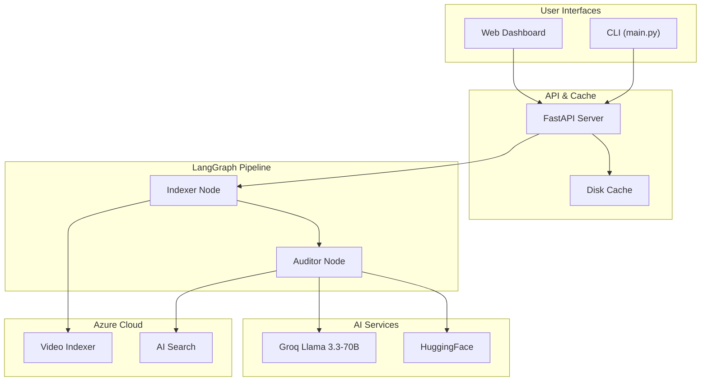
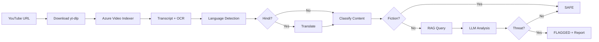

# 🇮🇳 National Security Shield

> AI-Powered Video Threat Detection for Indian National Security

[](.python-version)
[](https://fastapi.tiangolo.com)
[](https://langchain-ai.github.io/langgraph/)
[](https://groq.com)
[](https://azure.microsoft.com)

---

## Vision

An AI-powered national security intelligence platform that automatically detects, analyzes, and reports threats in video content — protecting India's digital sovereignty by identifying hostile content before it causes harm.

## Problem Statement

Social media platforms are weaponized for reconnaissance, hate speech, disinformation, and radicalization. Manual moderation cannot scale. Existing tools lack:
- Contextual understanding of Indian security threats
- Hindi/Urdu language support
- Intelligence-grade reporting for legal/agency action
- Fiction vs. real-world content discrimination

## Features

- **YouTube Video Analysis** — Download and analyze any YouTube video
- **Speech-to-Text + OCR** — Extract transcript with timestamps and on-screen text via Azure Video Indexer
- **Hindi/Urdu Translation** — Automatic language detection and Hindi→English translation (Helsinki-NLP)
- **Smart Content Classification** — Identifies news, movies, music, games, comedy, documentaries to reduce false positives
- **RAG-Enhanced Analysis** — Queries a national security knowledge base (Azure AI Search) for informed assessment
- **Groq Llama-3.3-70B Threat Analysis** — Detects terrorism, border security, cyber threats, fake news, hate speech, espionage
- **Intelligence Report Generation** — Formatted reports suitable for IT Act Section 69A takedowns and NIA referral
- **Intelligent Caching** — Same URL = instant result (configurable 7-day expiry)
- **Web Dashboard** — Dark-themed UI with real-time progress, threat cards, timeline, analytics
- **CLI Support** — Command-line interface for automation

## Tech Stack

| Layer | Technology |
|-------|-----------|
| **Language** | Python 3.13 |
| **Web Framework** | FastAPI + Uvicorn |
| **Workflow Engine** | LangGraph (StateGraph DAG) |
| **LLM Inference** | Groq Llama-3.3-70B-Versatile |
| **Embeddings** | HuggingFace all-MiniLM-L6-v2 |
| **Translation** | Helsinki-NLP opus-mt-hi-en |
| **Vector Database** | Azure AI Search |
| **Video Processing** | Azure Video Indexer |
| **Video Download** | yt-dlp |
| **Monitoring** | Azure Monitor OpenTelemetry |
| **Cache** | Disk-based (SHA-256 keyed, 7-day expiry) |
| **Frontend** | HTML + CSS + JS (Chart.js) |
| **Package Manager** | uv |

## Architecture



## Folder Structure

```
national-security-shield/
├── main.py                          # CLI entry point
├── pyproject.toml                   # Dependencies & metadata
├── .env                             # Environment variables
├── backend/
│   ├── cache/                       # JSON scan result cache
│   ├── data/                        # PDF knowledge base
│   ├── scripts/
│   │   └── index_documents.py       # PDF → Azure AI Search
│   └── src/
│       ├── api/
│       │   ├── server.py            # FastAPI (6 endpoints)
│       │   └── telemetry.py         # Azure Monitor
│       ├── graph/
│       │   ├── state.py             # LangGraph state schema
│       │   ├── nodes.py             # Pipeline nodes
│       │   └── workflow.py          # DAG definition
│       └── services/
│           ├── cache_service.py     # Disk cache
│           └── video_indexer.py     # Azure VI + yt-dlp
├── frontend/
│   └── index.html                   # Web dashboard
└── docs/                            # Documentation
```

## Installation

### Prerequisites

- Python 3.13+
- [uv](https://docs.astral.sh/uv/) package manager
- Azure subscription with Video Indexer, AI Search, and Storage Account
- Groq API key (free tier available)

### Setup

```bash
# Clone repository
git clone <repo-url>
cd national-security-shield

# Create virtual environment & install dependencies
uv venv
.venv\Scripts\activate   # Windows
uv sync

# Configure environment
cp .env.example .env
# Edit .env with your Azure and Groq credentials

# Index knowledge base documents
uv run python backend/scripts/index_documents.py

# Start the server
uvicorn backend.src.api.server:app --reload --port 8000
```

### Usage

**Web Dashboard:** Open `http://localhost:8000`

**CLI:**
```bash
uv run python main.py -u "https://www.youtube.com/watch?v=..."
```

## API Overview

| Method | Endpoint | Description |
|--------|----------|-------------|
| GET | `/` | Serve frontend UI |
| POST | `/scan` | Scan YouTube video for threats |
| GET | `/health` | Health check |
| GET | `/cache` | List cached results |
| DELETE | `/cache` | Wipe entire cache |
| DELETE | `/scan/cache` | Invalidate single cache entry |

**POST /scan** request body:
```json
{
  "video_url": "https://www.youtube.com/watch?v=...",
  "force_rescan": false
}
```

## Threat Detection Pipeline



## Deployment

See [Deployment Guide](docs/DEPLOYMENT_GUIDE.md) for:
- Docker containerization
- Azure App Service deployment
- Production hardening checklist
- Environment variable reference

## Security Notice

**⚠️ WARNING:** This repository currently has NO authentication layer and contains API keys in `.env`. Before any deployment:
1. Rotate all API keys immediately
2. Implement authentication
3. Restrict CORS origins
4. Enable HTTPS

See [Security Analysis](docs/SECURITY_ANALYSIS.md) for full assessment.

## Documentation

All documentation is in the `docs/` folder:

| Document | Description |
|----------|-------------|
| [Project Context](docs/PROJECT_CONTEXT.md) | Background, users, decisions |
| [Project Overview](docs/PROJECT_OVERVIEW.md) | Vision, features, roadmap |
| [System Architecture](docs/SYSTEM_ARCHITECTURE.md) | Architecture diagrams |
| [Folder Structure](docs/FOLDER_STRUCTURE.md) | File layout |
| [Database Design](docs/DATABASE_DESIGN.md) | Data storage architecture |
| [API Documentation](docs/API_DOCUMENTATION.md) | Endpoints, models, errors |
| [User Flow](docs/USER_FLOW.md) | User interaction flows |
| [Security Analysis](docs/SECURITY_ANALYSIS.md) | Vulnerability assessment |
| [Deployment Guide](docs/DEPLOYMENT_GUIDE.md) | Setup and deployment |
| [Improvement Suggestions](docs/IMPROVEMENT_SUGGESTIONS.md) | 45+ prioritized improvements |
| [AI Memory File](docs/CLAUDE.md) | Quick-start for AI agents |
| [Repository Analysis](docs/REPOSITORY_ANALYSIS_REPORT.md) | CTO due diligence report |

## Future Roadmap

- **Q3 2026:** Security hardening, testing, Docker, CI/CD
- **Q4 2026:** PostgreSQL, multi-platform support, auth
- **Q1 2027:** Real-time monitoring, WebSocket, mobile app
- **Q2 2027:** Advanced analytics, ML model fine-tuning, field deployment

## License

Proprietary — For authorized use by Indian security agencies.
