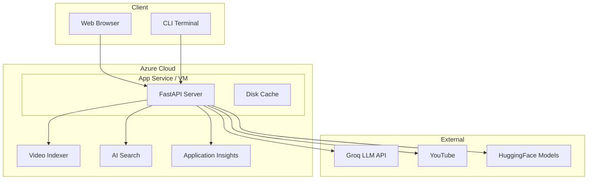

# Deployment Guide

## Prerequisites

- **Python 3.13+** (specified in `.python-version`)
- **uv** package manager (recommended) or pip
- **Azure Subscription** with:
  - Video Indexer resource
  - AI Search resource
  - Storage Account
  - Application Insights (optional)
- **Groq API key** (free tier available)

## Local Development Setup

### 1. Clone and Environment Setup

```bash
git clone <repo-url>
cd national-security-shield

# Create virtual environment
uv venv
.venv\Scripts\activate  # Windows
# or: source .venv/bin/activate  # Linux/Mac

# Install dependencies
uv sync
# or: pip install -e .
```

### 2. Environment Configuration

Copy `.env` and fill in your Azure credentials:

```bash
# Required for core functionality:
AZURE_STORAGE_CONNECTION_STRING="..."
GROQ_API_KEY="..."
AZURE_SEARCH_ENDPOINT="..."
AZURE_SEARCH_API_KEY="..."
AZURE_SEARCH_INDEX_NAME="national-security-rules"
AZURE_VI_NAME="..."
AZURE_VI_LOCATION="southeastasia"
AZURE_VI_ACCOUNT_ID="..."
AZURE_SUBSCRIPTION_ID="..."
AZURE_RESOURCE_GROUP="..."

# Optional:
APPLICATIONINSIGHTS_CONNECTION_STRING="..."
LANGCHAIN_API_KEY="..."
CACHE_EXPIRY_DAYS=7
```

### 3. Index Knowledge Base

```bash
uv run python backend/scripts/index_documents.py
```

This reads PDFs from `backend/data/`, chunks them, and uploads to Azure AI Search.

### 4. Start the API Server

```bash
uvicorn backend.src.api.server:app --reload --port 8000
```

### 5. Use the Web Dashboard

Open `http://localhost:8000` in a browser.

### 6. CLI Usage

```bash
uv run python main.py -u "https://www.youtube.com/watch?v=..."
```

## Deployment Options

### Option A: Direct Server (Linux VM)

```bash
# Install Python 3.13, uv, clone repo
uv sync

# Run with systemd or supervisor
uvicorn backend.src.api.server:app --host 0.0.0.0 --port 8000 --workers 4
```

### Option B: Docker (Recommended)

Create `Dockerfile`:

```dockerfile
FROM python:3.13-slim

WORKDIR /app
RUN pip install uv

COPY pyproject.toml uv.lock ./
RUN uv sync --frozen

COPY . .

EXPOSE 8000
CMD ["uvicorn", "backend.src.api.server:app", "--host", "0.0.0.0", "--port", "8000"]
```

### Option C: Azure App Service

1. Create App Service (Linux, Python 3.13)
2. Configure environment variables in App Settings
3. Deploy via GitHub Actions or zip deploy
4. Set startup command: `uvicorn backend.src.api.server:app --host 0.0.0.0 --port 8000`

## Production Checklist

- [ ] Rotate all `.env` secrets
- [ ] Move secrets to Azure Key Vault
- [ ] Implement authentication
- [ ] Restrict CORS origins
- [ ] Enable HTTPS/TLS
- [ ] Add rate limiting
- [ ] Set up CI/CD pipeline
- [ ] Add monitoring alerts
- [ ] Configure auto-scaling
- [ ] Remove unused dependencies
- [ ] Add unit/integration tests
- [ ] Set up audit logging

## Deployment Architecture Diagram



## Environment Variables Reference

| Variable | Required | Description |
|----------|----------|-------------|
| `AZURE_STORAGE_CONNECTION_STRING` | Yes | Azure Blob Storage connection |
| `GROQ_API_KEY` | Yes | Groq LLM API key |
| `AZURE_SEARCH_ENDPOINT` | Yes | Azure AI Search endpoint |
| `AZURE_SEARCH_API_KEY` | Yes | Azure AI Search admin key |
| `AZURE_SEARCH_INDEX_NAME` | Yes | Search index name |
| `AZURE_VI_NAME` | Yes | Video Indexer resource name |
| `AZURE_VI_LOCATION` | Yes | Azure region (e.g., southeastasia) |
| `AZURE_VI_ACCOUNT_ID` | Yes | Video Indexer account GUID |
| `AZURE_SUBSCRIPTION_ID` | Yes | Azure subscription GUID |
| `AZURE_RESOURCE_GROUP` | Yes | Resource group name |
| `APPLICATIONINSIGHTS_CONNECTION_STRING` | No | Azure Monitor telemetry |
| `LANGCHAIN_API_KEY` | No | LangSmith tracing |
| `LANGCHAIN_PROJECT` | No | LangSmith project name |
| `LANGCHAIN_ENDPOINT` | No | LangSmith endpoint |
| `LANGCHAIN_TRACING_V2` | No | Enable LangSmith tracing |
| `CACHE_EXPIRY_DAYS` | No | Cache TTL (default: 7) |
