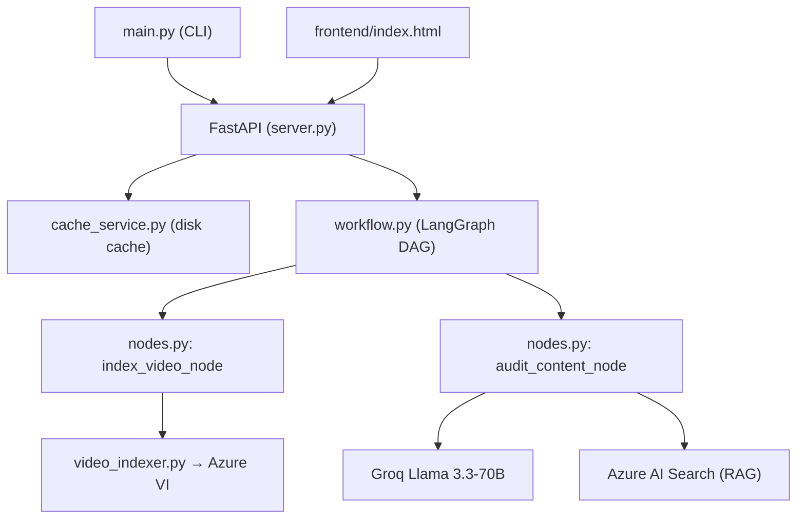

# Project Context — Local Development Only

> ⚠️ This file is for local development and AI agent use. **Do NOT publish publicly.**
> Contains internal architecture details, pending work items, and development notes.

---

## Project Summary

**National Security Shield** is an AI-powered YouTube video threat detection system for Indian national security. It downloads videos, extracts transcripts/OCR via Azure Video Indexer, translates Hindi to English, queries a national security knowledge base (RAG), and uses Groq's Llama-3.3-70B to analyze content for threats.

**Version:** 0.1.0 | **Python:** 3.13 | **Status:** MVP Prototype

---

## Architecture Overview



### LangGraph DAG
```
START → [indexer] → [auditor] → END
```

### State Schema (VideoSecurityState)
```python
{
    "video_url": str,
    "video_id": str,
    "local_file_path": Optional[str],
    "video_metadata": Dict,
    "transcript": Optional[str],      # Speech-to-text
    "ocr_text": List[str],            # On-screen text
    "security_flags": List[SecurityAlert],  # Detected threats
    "final_status": str,              # "SAFE" | "FLAGGED_FOR_TAKEDOWN"
    "final_report": str,              # Intelligence report
    "errors": List[str]
}
```

---

## Folder Structure

| Path | Purpose | Key Files |
|------|---------|-----------|
| `main.py` | CLI entry point | argparse, invokes LangGraph |
| `backend/src/api/server.py` | FastAPI server | 6 endpoints, CORS, static files |
| `backend/src/api/telemetry.py` | Azure Monitor | OpenTelemetry setup |
| `backend/src/graph/state.py` | State schema | VideoSecurityState TypedDict |
| `backend/src/graph/nodes.py` | **Core logic** | index_video_node, audit_content_node (485 lines) |
| `backend/src/graph/workflow.py` | DAG definition | StateGraph compilation |
| `backend/src/services/cache_service.py` | Disk cache | SHA-256 key, 7-day expiry |
| `backend/src/services/video_indexer.py` | Azure VI | yt-dlp + Azure API calls |
| `backend/scripts/index_documents.py` | KB ingestion | PDF → Azure AI Search |
| `frontend/index.html` | Web dashboard | Chart.js, dark theme, demo data |

---

## Key Features

1. YouTube video download (yt-dlp with Android/Web client fallback)
2. Azure Video Indexer upload → wait → extract transcript + OCR (with timestamps)
3. Language detection (langdetect) + Hindi→English translation (Helsinki-NLP opus-mt-hi-en)
4. Smart content classification — detects 6 fiction types to reduce false positives:
   - NEWS_BROADCAST, MOVIE_OR_WEB_SERIES, MUSIC_OR_RAP, VIDEO_GAME, COMEDY_OR_SATIRE, DOCUMENTARY_OR_EDUCATIONAL
5. RAG query from Azure AI Search (all-MiniLM-L6-v2 embeddings, k=3)
6. LLM threat analysis via Groq `llama-3.3-70b-versatile` (temperature=0.0)
7. Category normalization (keyword-based: TERRORISM, BORDER_SECURITY, CYBER_THREAT, FAKE_NEWS, HATE_SPEECH, ESPIONAGE)
8. Timestamp mapping from transcript to flag
9. Intelligence report generation (classified format)
10. Disk cache (SHA-256 hash of video ID, 7-day expiry, JSON files)

---

## Important Workflows

### Scan Pipeline
```
User submits URL → Cache check → [Cache HIT: instant return]
                              → [Cache MISS: full pipeline]
  1. yt-dlp download → Azure VI upload → wait (30s poll) → extract
  2. Language detect → translate if Hindi → classify content type
  3. If fiction → SAFE (skip LLM)
  4. If real → RAG query (3 docs) → LLM prompt → parse JSON → normalize → timestamp → report
  5. Cache result → return
```

### Content Classification Decision Tree
```
Transcript → Language Detection → Hindi? → Translate
                                        → English
Fiction Check → News? Movie? Music? Game? Comedy? Doc?
              → YES: SAFE (skip LLM)
              → NO: Proceed to RAG + LLM
```

### Threat Categories & Severities
| Category | Sample Keywords | Default Severity |
|----------|----------------|-----------------|
| TERRORISM | bomb, attack, terror, blast, kill | CRITICAL |
| BORDER_SECURITY | border, army, troop, military, CRPF | HIGH |
| CYBER_THREAT | hack, cyber, malware, ransomware | HIGH |
| FAKE_NEWS | fake, rumor, misinformation, propaganda | WARNING |
| HATE_SPEECH | hate, religion, communal, violence against | HIGH |
| ESPIONAGE | spy, espionage, ISI, secret leak | CRITICAL |

---

## APIs

| Method | Endpoint | Query/ Body | Response |
|--------|----------|-------------|----------|
| GET | `/` | — | `frontend/index.html` |
| POST | `/scan` | `{"video_url": "...", "force_rescan": false}` | `AuditResponse` |
| DELETE | `/scan/cache` | `?video_url=...` | `{"success": bool}` |
| GET | `/cache` | — | `{"total": N, "entries": [...]}` |
| DELETE | `/cache` | — | `{"deleted": N}` |
| GET | `/health` | — | `{"status": "Active", "version": "3.0.0"}` |

### Pydantic Models (server.py)
```python
class AuditRequest(BaseModel):
    video_url: str
    force_rescan: bool = False

class SecurityAlertModel(BaseModel):
    category: str
    severity: str
    description: str
    timestamp: Optional[str] = None
    confidence: Optional[float] = None

class AuditResponse(BaseModel):
    session_id: str
    video_id: str
    status: str
    final_report: str
    security_flags: List[SecurityAlertModel]
    from_cache: bool = False
```

---

## Security Model

**Current: NO AUTHENTICATION. ALL ENDPOINTS PUBLIC.**

Critical issues (documented in SECURITY_ANALYSIS.md):
- 12 live API keys in `.env` — rotate immediately
- No API authentication
- CORS: `allow_origins=["*"]`
- No rate limiting
- No HTTPS
- No audit logging
- No input validation (basic YouTube URL check only)
- Keyword-based category normalization (bypassable)

---

## Dependencies

All in `pyproject.toml`. Key ones:
- `langgraph`, `langchain-groq`, `langchain-huggingface`, `langchain-community`
- `fastapi`, `uvicorn`, `pydantic`, `python-multipart`
- `azure-core`, `azure-identity`, `azure-search-documents`, `azure-storage-blob`, `azure-monitor-opentelemetry`
- `yt-dlp`, `pypdf`, `tiktoken`, `transformers`, `sentencepiece`
- `langdetect`, `python-dotenv`, `requests`

**Unused dependencies (listed but not imported):**
- `psycopg2-binary`, `sqlalchemy`, `redis`, `streamlit`, `firecrawl-py`, `pandas`

---

## Known Issues

1. Zero test coverage (no pytest files)
2. Hardcoded temp file: `temp_security_video.mp4` (race condition)
3. Global `translator` variable in `nodes.py:21` (not thread-safe)
4. Synchronous video download blocks event loop
5. YouTube-only — no Instagram/Twitter/Facebook support
6. No retry logic for Azure VI failures
7. Keyword-based category normalization (bypassable with synonyms)
8. Static demo data in frontend (`index.html:937-983`)
9. No background task queue — long scans block HTTP responses
10. `video_indexer.py` builds URLs with `f""` strings (injection risk if env vars compromised)

---

## Development Commands

```bash
# Start development server
uvicorn backend.src.api.server:app --reload --port 8000

# Index knowledge base documents
uv run python backend/scripts/index_documents.py

# Run CLI scan
uv run python main.py -u "https://www.youtube.com/watch?v=..."

# Install dependencies
uv sync

# Freeze dependencies
uv lock
```

---

## Pending Tasks (Highest Priority)

1. **Rotate all 12 live secrets** in `.env`
2. Add JWT authentication to API
3. Add rate limiting middleware
4. Restrict CORS origins
5. Write unit tests (pytest)
6. Create Dockerfile
7. Set up CI/CD (GitHub Actions)
8. Implement PostgreSQL database
9. Add multi-platform video support
10. Replace static frontend data with dynamic API

---

## Future Roadmap

| Phase | Timeline | Deliverables |
|-------|----------|-------------|
| Security Hardening | Week 1 | Secret rotation, auth, rate limiting, CORS, HTTPS |
| Quality Foundation | Week 2-3 | Tests, Docker, CI/CD, audit logging |
| Production Readiness | Week 3-4 | PostgreSQL, WebSocket, multi-platform, background tasks |
| Advanced Features | Week 5+ | Real-time monitoring, face detection, sentiment, mobile app |

---

## AI Agent Quick Start

Welcome, AI agent. Here's everything you need to continue development immediately:

### 1. Understand the Core Pipeline

The project uses a **LangGraph StateGraph** with 2 nodes executing sequentially:

```python
# backend/src/graph/workflow.py
workflow = StateGraph(VideoSecurityState)
workflow.add_node("indexer", index_video_node)   # Download + Azure VI
workflow.add_node("auditor", audit_content_node)  # Language + RAG + LLM
workflow.set_entry_point("indexer")
workflow.add_edge("indexer", "auditor")
workflow.add_edge("auditor", END)
app = workflow.compile()
```

### 2. Key Files to Modify

| Task | File(s) |
|------|---------|
| Add new threat category | `backend/src/graph/nodes.py:24-38` (normalize_category) |
| Add new content type | `backend/src/graph/nodes.py:43-141` (detect_content_type) |
| Modify LLM prompt | `backend/src/graph/nodes.py:368-416` (system_prompt) |
| Add API endpoint | `backend/src/api/server.py` |
| Modify cache logic | `backend/src/services/cache_service.py` |
| Change UI | `frontend/index.html` |

### 3. Data Flow

```
State input:  {"video_url": str, "video_id": str, "security_flags": [], "errors": []}

After indexer: State gains: transcript (list of {text, start, end}), ocr_text (list), video_metadata (dict)

After auditor: State gains: security_flags (list of alerts), final_status (str), final_report (str)

State output: full VideoSecurityState dict
```

### 4. Common Patterns

- **SecurityAlert format:** `{"category": str, "description": str, "severity": str, "timestamp": Optional[str], "confidence": Optional[float]}`
- **Cache key:** SHA-256(video_id)[:16] → `backend/cache/{hash}.json`
- **Cache entry:** `{"video_url": str, "cached_at": ISO datetime, "expires_in": "N days", "result": {...}}`
- **LLM response format:** Strict JSON: `{"security_flags": [...], "status": "SAFE"|"FLAGGED_FOR_TAKEDOWN", "executive_summary": str}`
- **Error handling pattern:** Return partial state with `errors.append(error_msg)` instead of raising

### 5. Environment Variables Required

```bash
# Required
AZURE_STORAGE_CONNECTION_STRING  # Azure Blob Storage
GROQ_API_KEY                     # Groq LLM access
AZURE_SEARCH_ENDPOINT            # Azure AI Search URL
AZURE_SEARCH_API_KEY             # Search admin key
AZURE_SEARCH_INDEX_NAME          # "national-security-rules"
AZURE_VI_NAME                    # Video Indexer resource
AZURE_VI_LOCATION                # e.g., "southeastasia"
AZURE_VI_ACCOUNT_ID              # VI account GUID
AZURE_SUBSCRIPTION_ID            # Azure subscription GUID
AZURE_RESOURCE_GROUP             # Resource group name

# Optional
APPLICATIONINSIGHTS_CONNECTION_STRING  # Azure Monitor
LANGCHAIN_API_KEY                      # LangSmith tracing
CACHE_EXPIRY_DAYS                      # Default: 7
```

### 6. First-Time Setup for AI Agent

```bash
# 1. Install uv package manager (if not present)
pip install uv

# 2. Create venv and install dependencies
uv venv
.venv\Scripts\activate  # Windows
uv sync

# 3. Set up environment
cp .env.example .env
# Fill in credentials from project vault

# 4. Index knowledge base (requires Azure AI Search configured)
uv run python backend/scripts/index_documents.py

# 5. Start server
uvicorn backend.src.api.server:app --reload --port 8000

# 6. Test with demo button (opens at http://localhost:8000)
# Or use CLI:
uv run python main.py -u "https://www.youtube.com/watch?v=demo"
```

### 7. Quick Reference

```python
# Import the compiled graph
from backend.src.graph.workflow import app

# Invoke the pipeline
result = app.invoke({
    "video_url": "https://youtube.com/watch?v=...",
    "video_id": "vid_demo",
    "security_flags": [],
    "errors": []
})

# Check result
print(result["final_status"])    # "SAFE" or "FLAGGED_FOR_TAKEDOWN"
print(result["security_flags"])  # List of alerts
print(result["final_report"])    # Formatted report
```

### 8. Architecture Constraints

- **No async support in workflow** — LangGraph invoke is synchronous
- **Azure VI polling** — 30s fixed interval, no webhook support
- **Embedding model** — all-MiniLM-L6-v2 (384-dim, runs locally)
- **Translation model** — Helsinki-NLP opus-mt-hi-en (~300MB, loaded lazily)
- **LLM** — Groq llama-3.3-70b-versatile, temperature=0.0
- **Cache** — Single-server disk cache (not distributed)
- **Frontend** — Single HTML file, no build step, no framework
