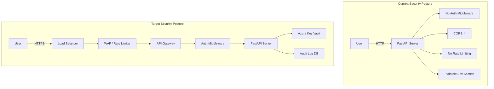

# Security Analysis

## Current Vulnerabilities

### CRITICAL: Exposed Secrets in `.env`

The `.env` file contains **live production API keys and secrets**:

| Secret | Type | Risk |
|--------|------|------|
| `AZURE_STORAGE_CONNECTION_STRING` | Azure Storage key | Full storage account access |
| `GROQ_API_KEY` | Groq LLM API key | Unauthorized LLM usage |
| `AZURE_SEARCH_API_KEY` | Azure Search admin key | Full search index access |
| `APPLICATIONINSIGHTS_CONNECTION_STRING` | Azure Monitor key | Telemetry data access |
| `LANGCHAIN_API_KEY` | LangSmith API key | Tracing data access |
| `AZURE_SUBSCRIPTION_ID` | Azure subscription ID | Subscription enumeration |
| `AZURE_VI_ACCOUNT_ID` | Video Indexer account ID | Media processing access |

**Recommendation:** Revoke all keys immediately, rotate them, and use a secrets manager (Azure Key Vault, HashiCorp Vault, or GitHub Secrets).

### CRITICAL: No Authentication

- **All API endpoints are publicly accessible**
- No API key validation, JWT tokens, or session authentication
- Anyone who can reach the server can scan videos, manage cache, and access health data
- No rate limiting — susceptible to denial-of-service and resource exhaustion

### HIGH: CORS Misconfiguration

```python
app.add_middleware(
    CORSMiddleware,
    allow_origins=["*"],  # Allows any origin
    allow_credentials=True,
    allow_methods=["*"],
    allow_headers=["*"],
)
```

- `allow_origins=["*"]` with `allow_credentials=True` is insecure
- Any website can make authenticated requests to this API

### HIGH: No Input Validation

- `video_url` is only validated for `youtube.com` or `youtu.be` substring presence
- LLM responses are parsed with `json.loads()` after minimal markdown cleanup
- No sanitization of user-provided URLs before passing to yt-dlp

### MEDIUM: No HTTPS

- Server runs on HTTP (development mode)
- All data (including any future auth tokens) transmitted in plaintext

### MEDIUM: Local File Handling

- Videos are downloaded to a hardcoded path `temp_security_video.mp4`
- No disk space quota or cleanup mechanism for failed downloads
- Potential race condition on concurrent downloads

### MEDIUM: Cache Poisoning

- Cache key derived from YouTube video ID extracted from URL
- Cache has no integrity validation
- Corrupt cache files are silently deleted but no alert is raised

### LOW: No Audit Logging

- No audit trail of who scanned what video or when
- No request logging beyond basic Python logger

### LOW: Dependency Bloat

- Unused dependencies (psycopg2-binary, redis, sqlalchemy, streamlit, firecrawl-py) increase attack surface
- `streamlit` and `firecrawl-py` are not used anywhere but are listed

## Security Architecture



## Recommended Remediations

| Priority | Issue | Fix |
|----------|-------|-----|
| P0 | Exposed secrets | Rotate all keys, move to Key Vault / env injection |
| P0 | No authentication | Implement API key + JWT authentication |
| P1 | CORS misconfig | Restrict `allow_origins` to specific domains |
| P1 | No rate limiting | Add `slowapi` or middleware rate limiting |
| P1 | No HTTPS | Configure TLS certificates |
| P2 | No input validation | Add URL validation, sanitize yt-dlp arguments |
| P2 | No audit logging | Implement structured audit log |
| P3 | Dependency bloat | Remove unused dependencies |
| P3 | Hardcoded file paths | Use tempfile with cleanup |
