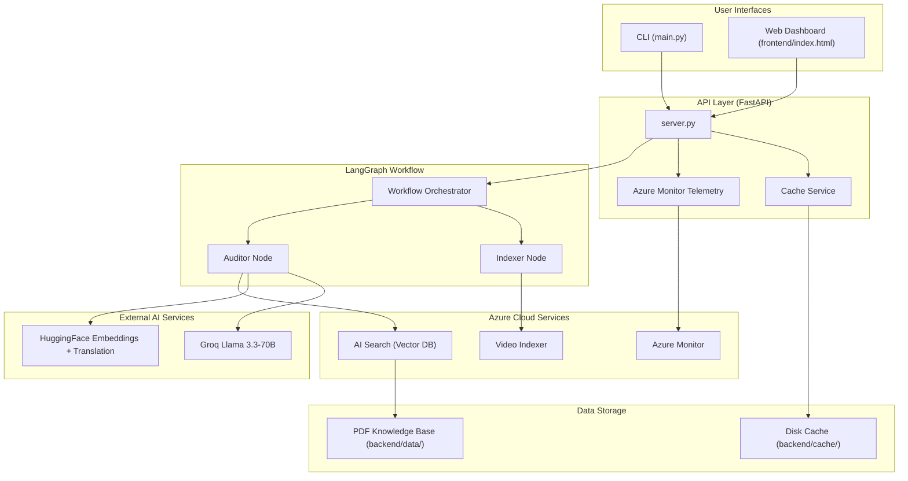
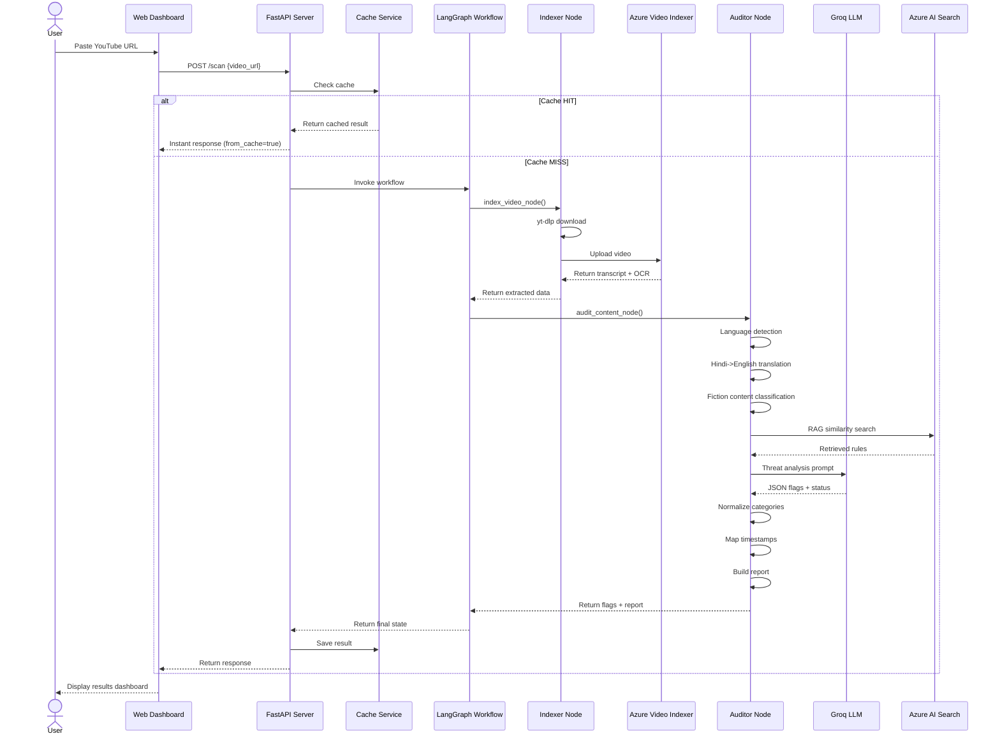
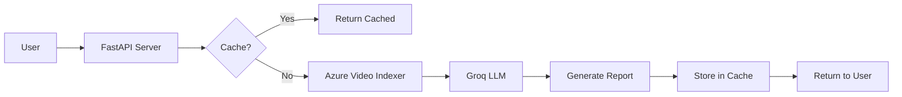
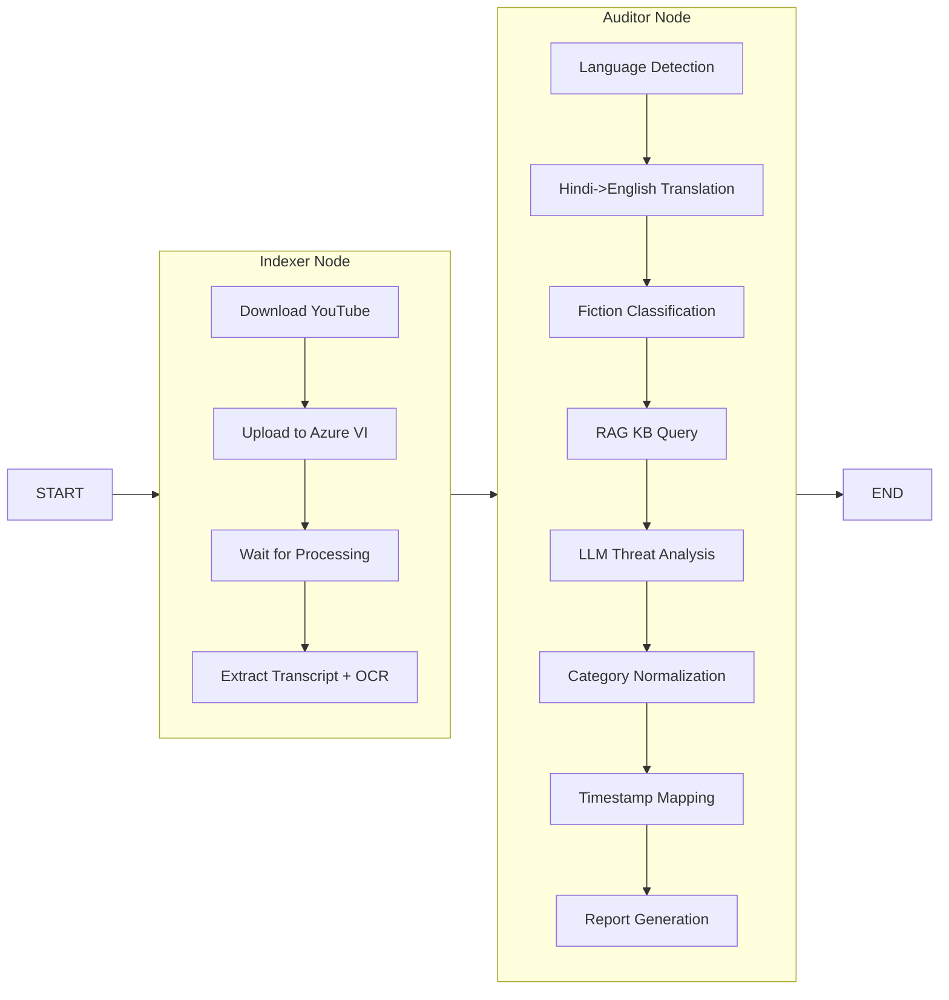

# System Architecture

## High-Level Architecture

## Request Flow

## Authentication Flow

**Note:** There is currently NO authentication layer. The API is open access.

## LangGraph Workflow (DAG)

## Component Details

### 1. API Layer (`backend/src/api/server.py`)
- FastAPI application (v3.0.0)
- CORS: Allow all origins (`*`)
- Serves static frontend from `frontend/`
- Endpoints: POST `/scan`, DELETE `/scan/cache`, GET `/cache`, DELETE `/cache`, GET `/health`

### 2. LangGraph Workflow (`backend/src/graph/workflow.py`)
- `StateGraph(VideoSecurityState)` with 2 nodes
- Entry: `indexer` → `auditor` → END
- State: TypedDict with `video_url`, `video_id`, `transcript`, `ocr_text`, `security_flags`, `final_status`, `final_report`, `errors`

### 3. Cache Service (`backend/src/services/cache_service.py`)
- Location: `backend/cache/`
- Key: SHA-256 hash of YouTube video ID (first 16 chars)
- Format: JSON files with `{video_url, cached_at, expires_in, result}`
- Expiry: Configurable via `CACHE_EXPIRY_DAYS` (default: 7)

### 4. Video Indexer Service (`backend/src/services/video_indexer.py`)
- Azure Video Indexer integration
- yt-dlp for YouTube downloads
- Token-based authentication (ARM → Account token)
- Polling-based processing status check (30s intervals)

### 5. Threat Analysis (`backend/src/graph/nodes.py`)
- Language detection via `langdetect`
- Hindi translation via `Helsinki-NLP/opus-mt-hi-en`
- Content type classification (6 categories)
- RAG via Azure AI Search with HuggingFace embeddings
- LLM analysis via Groq `llama-3.3-70b-versatile`
- Category normalization (keyword-based)
- Intelligence report formatting
