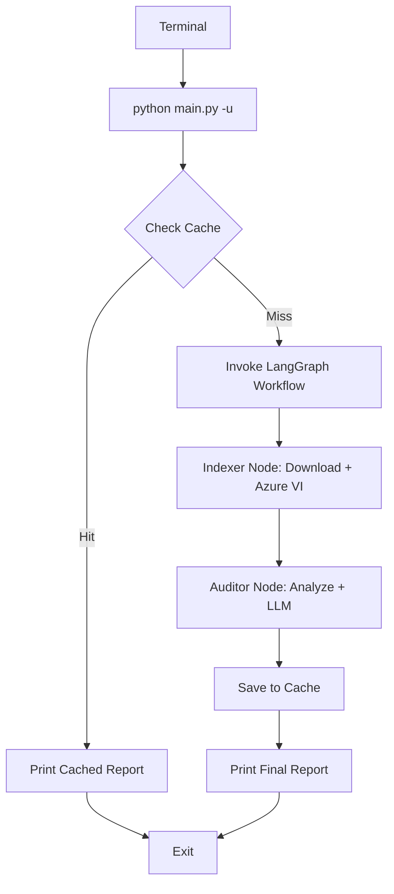
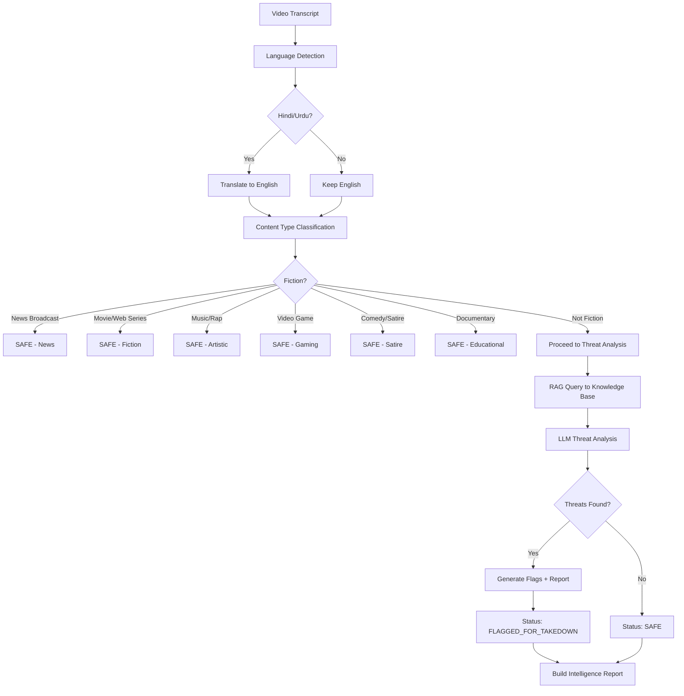
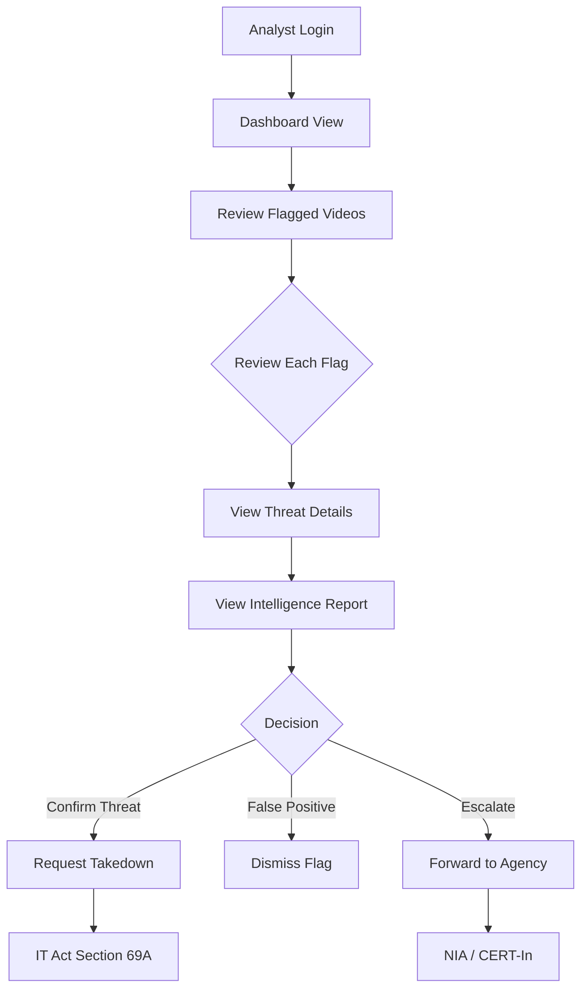

# User Flow

## Web Dashboard Flow

```mermaid
flowchart TD
    A[User Opens Dashboard] --> B[Land on Scan View]
    B --> C{Paste YouTube URL}
    C --> D[Click "Scan Video"]
    D --> E[Progress View]
    
    E --> F[Step 1: Download & Index]
    F --> G[Step 2: Extract Transcript & OCR]
    G --> H[Step 3: Language Detection & Translation]
    H --> I[Step 4: Query Knowledge Base]
    I --> J[Step 5: LLM Threat Analysis]
    
    J --> K{Result}
    K -->|Safe| L[Results View: Safe Banner]
    K -->|Flagged| M[Results View: Flagged Banner]
    
    L --> N[View Intelligence Report]
    M --> N
    
    N --> O[Threat Cards + Timeline]
    O --> P[Analytics View]
    
    subgraph "Cache Path"
        C --> Q{Cache Hit?}
        Q -->|Yes| R[Instant Results]
        Q -->|No| D
    end
```

## CLI Flow



## Content Analysis Decision Tree



## Security Analyst Workflow (Target)



## Threat Categories Detected

| Category | Description | Example Signals |
|----------|-------------|-----------------|
| **TERRORISM** | Bombings, attacks, explosions, killings | "bomb", "attack", "blast", "terror", "shoot" |
| **BORDER_SECURITY** | Military/troop movements, patrol gaps | "border", "army", "troop", "CRPF", "BSF" |
| **CYBER_THREAT** | Hacking, malware, phishing | "hack", "cyber", "malware", "ransomware" |
| **FAKE_NEWS** | Disinformation, propaganda | "fake", "rumor", "misinformation", "propaganda" |
| **HATE_SPEECH** | Communal violence, religious targeting | "hate", "communal", "religion", "violence against" |
| **ESPIONAGE** | Intelligence leaks, spy activity | "spy", "ISI", "secret leak", "intelligence leak" |

## Severity Levels

| Level | Meaning | Action Required |
|-------|---------|-----------------|
| **CRITICAL** | Imminent threat, actionable intelligence | Immediate takedown (IT Act 69A), forward to NIA |
| **HIGH** | Significant threat, communal hate speech | Escalate to CERT-In within 24 hours |
| **WARNING** | Suspicious pattern, possible propaganda | Routine monitoring |
